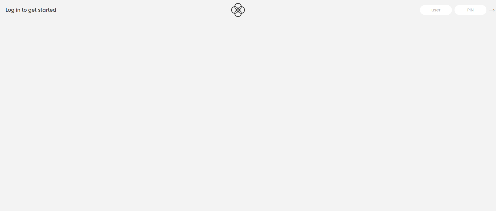
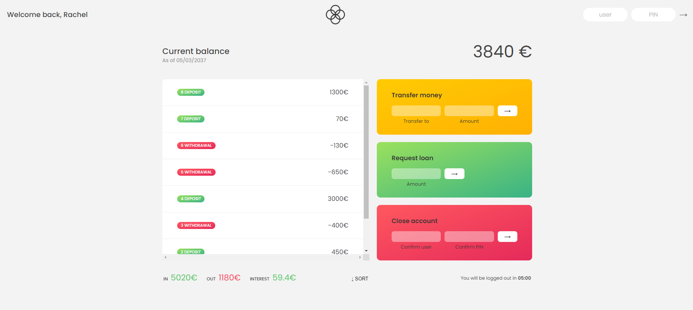

# BANKIST

Bankist is an online banking web application for a fictional company. This web application allows users to:

- Log in to their account using credentials
- Log in timer set to 5:00 minutes
- View account balance, transaction history and interest accrued on the account
- Transfer money to another account
- Loan requests with a 10 second delay for processing
- Close account

## Log In Credentials

There are two accounts being used for this application currently. Login credentials include the user id and a PIN.

User 1: Rachel Green | User: rg | PIN: 1111
User 2: Joey Tribbiani | User: jt | PIN: 2222

## Live Site

The live site is currently hosted by Netlify.

[Bankist Live Site](https://bankist-caitlin-malloch.netlify.app)bankist-caitlin-malloch.netlify.app

Preview of the login screen:

Preview of the user's account page:

## Tech Stack

- HTML
- CSS
- JavaScript

## Developer

Caitlin Malloch

## License

MIT License

Copyright (c) 2022 Caitlin Malloch

Permission is hereby granted, free of charge, to any person obtaining a copy
of this software and associated documentation files (the "Software"), to deal
in the Software without restriction, including without limitation the rights
to use, copy, modify, merge, publish, distribute, sublicense, and/or sell
copies of the Software, and to permit persons to whom the Software is
furnished to do so, subject to the following conditions:

The above copyright notice and this permission notice shall be included in all
copies or substantial portions of the Software.

THE SOFTWARE IS PROVIDED "AS IS", WITHOUT WARRANTY OF ANY KIND, EXPRESS OR
IMPLIED, INCLUDING BUT NOT LIMITED TO THE WARRANTIES OF MERCHANTABILITY,
FITNESS FOR A PARTICULAR PURPOSE AND NONINFRINGEMENT. IN NO EVENT SHALL THE
AUTHORS OR COPYRIGHT HOLDERS BE LIABLE FOR ANY CLAIM, DAMAGES OR OTHER
LIABILITY, WHETHER IN AN ACTION OF CONTRACT, TORT OR OTHERWISE, ARISING FROM,
OUT OF OR IN CONNECTION WITH THE SOFTWARE OR THE USE OR OTHER DEALINGS IN THE
SOFTWARE.

## Acknowledgements

- The Complete JavaScript Course 2022: From Zero to Expert! by Jonas Schmedtmann

## Current bugs

- The sort functionality
